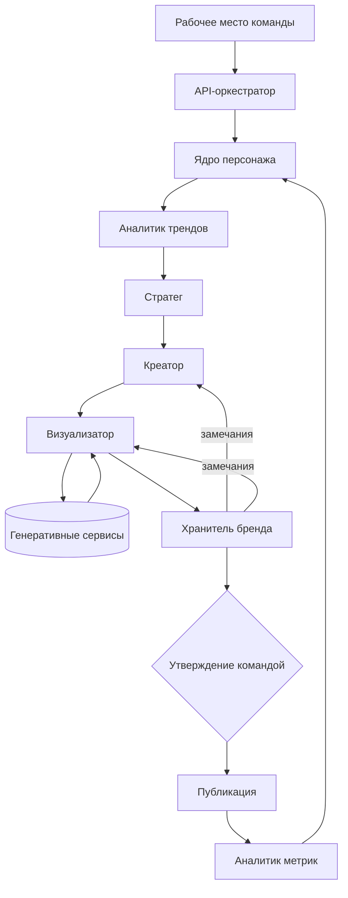

# Erzetix AI Studio B2B

Мультиагентная система автоматизированного производства медиаконтента для ведения аккаунтов компаний виртуальными персонажами под ключ.


Для каждой компании создаётся виртуальный персонаж под её бренд. Команда ведёт аккаунт компании полностью: определяет содержание, утверждает и публикует материалы, передаёт компании периодические отчёты. Компания в производстве контента непосредственно не участвует; согласование отдельных материалов и корректировка направления ведения аккаунта выполняются на созвонах и в переписке.

Комплекс выполняет полный производственный цикл: приём брифа, анализ актуальной повестки, планирование контента, формирование текстов и сценариев, генерацию изображений и видео, проверку на соответствие бренду и подготовку материалов к публикации. Участие человека предусмотрено на этапе утверждения материалов и выполняется командой.



## Устройство

Подсистемы не взаимодействуют между собой напрямую. Передача данных, обращение к внешним генеративным сервисам, учёт состояния кампании и числа циклов доработки выполняются API-оркестратором.

Выходные данные каждой подсистемы соответствуют входному контракту следующей; преобразование данных на стыках не выполняется. Результаты публикаций возвращаются в ядро персонажа и учитываются при обработке последующих кампаний.

| Подсистема | Назначение | Модель |
|---|---|---|
| [Ядро персонажа](agents/character-core/) | Единый источник сведений об идентичности персонажа | Sonnet 5 |
| [Аналитик трендов](agents/trend-analyst/) | Отбор актуальных тем, применимых к персонажу | Haiku 4.5 |
| [Стратег](agents/strategist/) | Формирование контент-плана на производственный цикл | Sonnet 5 |
| [Креатор](agents/creator/) | Формирование текстов, сценариев и диалогов | Sonnet 5 |
| [Визуализатор](agents/visualizer/) | Генерация изображений, видео и синтез речи | Sonnet 5 |
| [Хранитель бренда](agents/brand-guardian/) | Автоматическая проверка материалов | Sonnet 5 / Opus 4.8 |
| [API-оркестратор](orchestrator/) | Управление конвейером и внешними сервисами | — |
| [Рабочее место команды](workspace/) | Постановка задач, утверждение, показатели, отчёты для компаний | — |

Контур Human-in-the-Loop реализован средствами рабочего места команды и поддерживает ручной, гибридный и автономный режимы утверждения. Для отдельных материалов назначается согласование с компанией; решение компании фиксируется специалистом команды. Материал, не получивший утверждения, в публикацию не передаётся.

Компании доступа к рабочему месту команды не имеют. Результаты ведения аккаунта передаются компании в виде периодического отчёта.

Генерация изображений, видео и синтез речи выполняются через внешние сервисы. Для каждого типа задач предусмотрены основной и резервный провайдеры; отказ одного сервиса не останавливает производственный конвейер.

## С чего начать

1. [Архитектура](docs/ARCHITECTURE.md) — состав подсистем, состояния кампании, принципы обработки отказов
2. [Поток данных](docs/DATA_FLOW.md) — какие объекты передаются между подсистемами и в каком порядке
3. Каталог конкретной подсистемы — контракты, структуры данных, обработка ошибок

Дополнительно: [технологический стек](docs/TECH_STACK.md), [дорожная карта](docs/ROADMAP.md).

## Состав репозитория

```
.
├── agents/              Подсистемы-агенты
├── orchestrator/        API-оркестратор контент-пайплайна
├── workspace/           Рабочее место команды
├── docs/                Документация проекта
└── examples/            Примеры производимого контента
```

Каталог каждой подсистемы содержит описание назначения и контрактов, структуры передаваемых данных (`models.py`) и конфигурацию с перечнем операций.

Репозиторий содержит контракты и структуры данных. Параметры идентичности персонажей, системные промпты, шаблоны технических промптов, правила проверки контента, требования брендов и условия договоров с компаниями, учётные данные доступа к аккаунтам компаний относятся к коммерческой тайне, размещаются в защищённом хранилище и в открытом репозитории не публикуются. Подсистемы оперируют ссылками на защищаемые сведения и не содержат их в составе программного кода.

## Статус

Этап 1 завершён: разработано техническое задание, спроектирована архитектура, зафиксированы контракты передачи данных и схема производственного конвейера.

Этап 2 в разработке: реализация подсистем, развёртывание защищённого хранилища параметров идентичности, калибровка параметров на реальных данных, тестирование.

Часть параметров намеренно не установлена на этапе проектирования и определяется по результатам эксплуатации: пороговые значения оценки трендов и визуальной консистентности, условия эскалации проверки, параметры повторных вызовов подсистем. Состав работ приведён в [дорожной карте](docs/ROADMAP.md).

## О проекте

Первый виртуальный персонаж комплекса — Ник ([@nickitix](https://www.instagram.com/nickitix/)), собственный персонаж команды, на котором отработаны основные элементы системы в условиях коммерческого производства. Примеры материалов и показатели публикаций — в каталоге [examples](examples/).

Целевой показатель — производство не менее 70 концептов контента в неделю силами команды из 3–4 человек в контуре утверждения.

Проект реализуется при поддержке Фонда содействия инновациям в рамках программы «Студенческий стартап».

## Лицензия

Все права защищены. Использование материалов репозитория без согласования с правообладателем не допускается.
