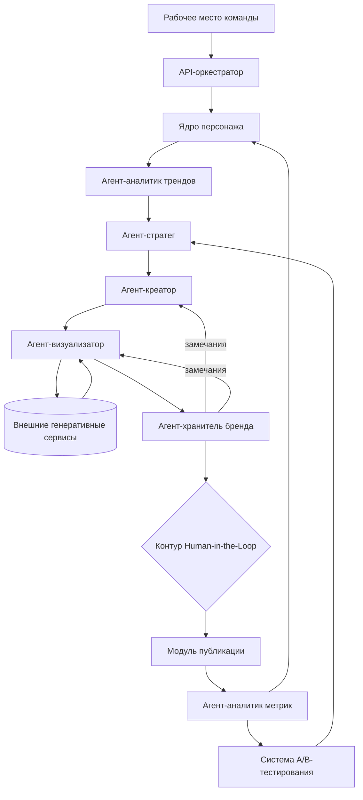
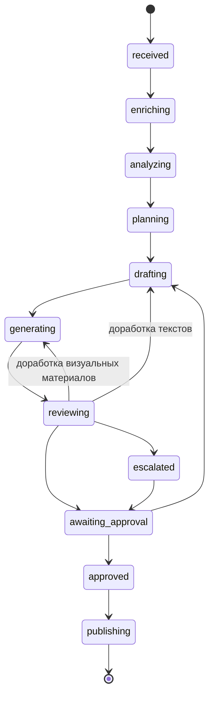

# Архитектура

Комплекс обеспечивает ведение аккаунтов компаний под ключ: для каждой компании создаётся виртуальный персонаж под её бренд, производство и публикация контента выполняются командой. Компании в производстве контента непосредственно не участвуют; согласование отдельных материалов и корректировка направления ведения аккаунта выполняются вне комплекса.

Комплекс построен по принципу микросервисной архитектуры: каждая подсистема реализована как отдельный сервис и может масштабироваться, обновляться и заменяться независимо от остальных.

Производственный цикл организован как мультиагентная система: подсистемы-агенты отвечают за отдельные этапы производства контента и не взаимодействуют между собой напрямую. Передача данных, обработка отказов и учёт состояния кампании выполняются API-оркестратором.

## Схема производственного конвейера

## Передача данных между подсистемами

Выходные данные каждой подсистемы соответствуют входному контракту следующей. Преобразование данных на стыках не выполняется.

| Подсистема | Принимает | Возвращает |
|---|---|---|
| Ядро персонажа | `Brief` | `CampaignContext` |
| Агент-аналитик трендов | `CampaignContext` | `TrendReport` |
| Агент-стратег | `CampaignContext`, `TrendReport`, `ABRecommendation` | `ContentPlan` |
| Агент-креатор | `CampaignContext`, `ContentPlan`, `RevisionNote` | `DraftBundle` |
| Агент-визуализатор | `CampaignContext`, `DraftBundle`, `RevisionNote` | `AssetBundle` |
| Агент-хранитель бренда | `CampaignContext`, `DraftBundle`, `AssetBundle` | `ReviewReport` |

Структуры данных описаны в модулях `models.py` соответствующих подсистем. Порядок передачи приведён в [DATA_FLOW.md](DATA_FLOW.md).

## Состояния кампании

Учёт состояния кампании ведётся API-оркестратором. Переход, не предусмотренный таблицей допустимых переходов, не выполняется.

Переход в состояние `publishing` выполняется исключительно из состояния `approved`. Материал, не получивший утверждения, в модуль публикации не передаётся.

## Подсистемы

### Ядро персонажа

Единый источник достоверных сведений об идентичности персонажа: визуальной айдентике, голосовых характеристиках, чертах поведения и коммуникативном стиле. Принимает бриф и формирует контекст кампании. Получает результаты кампаний от агента-аналитика метрик и обновляет параметры поведенческой логики персонажа.

Параметры идентичности размещаются в защищённом хранилище, подсистема оперирует ссылками на них. Принадлежность прав на персонажа — команде, компании или совместно — определяется договором с компанией и фиксируется в профиле персонажа.

Документация: [`agents/character-core/`](../agents/character-core/)

### Агент-аналитик трендов

Выполняет мониторинг внешних источников и отбор трендов, применимых к персонажу. Отклонённые тренды сохраняются с указанием причины отклонения, что обеспечивает трассируемость решений об отборе.

Документация: [`agents/trend-analyst/`](../agents/trend-analyst/)

### Агент-стратег

Формирует контент-план на недельный производственный цикл. При отсутствии применимых трендов план формируется на базовых сценариях персонажа. При конфликте ограничений брифа и приоритетов трендов приоритет отдаётся ограничениям брифа.

Документация: [`agents/strategist/`](../agents/strategist/)

### Агент-креатор

Формирует тексты, сценарии и диалоги в голосе и стиле персонажа. Реплики формируются с учётом ограничений синтеза речи и длительности сцены. Выполняет доработку материалов по замечаниям агента-хранителя бренда.

Документация: [`agents/creator/`](../agents/creator/)

### Агент-визуализатор

Формирует технические промпты для генеративных сервисов, выбирает провайдера под задачу и обеспечивает визуальную консистентность персонажа между материалами. Материалы, не соответствующие эталонным параметрам внешности, направляются на повторную генерацию.

Документация: [`agents/visualizer/`](../agents/visualizer/)

### Агент-хранитель бренда

Выполняет автоматическую проверку материалов по категориям: визуальная консистентность, соответствие требованиям бренда, соответствие правилам допустимого контента, соблюдение ограничений брифа, наличие репутационного риска. Является последней автоматической проверкой перед участием человека.

Для случаев, требующих оценки неоднозначного контекста, предусмотрена эскалация на модель более высокого уровня возможностей.

Документация: [`agents/brand-guardian/`](../agents/brand-guardian/)

### Контур Human-in-the-Loop

Утверждение материалов командой. Реализован средствами рабочего места команды. Поддерживает три режима: ручной, гибридный и автономный. Режим устанавливается отдельно для каждой компании.

Для отдельных материалов назначается согласование с компанией. Решение компании, полученное вне комплекса, фиксируется специалистом команды; до его фиксации материал в публикацию не передаётся.

Материалы, исчерпавшие число циклов автоматической доработки, передаются в контур с заключением `escalated`.

### Модуль публикации

Формирует итоговый пакет утверждённого контента для передачи специалистам команды, размещающим материалы в аккаунтах компаний на платформах. Обеспечивает соблюдение требований к маркировке контента, созданного с использованием технологий искусственного интеллекта. Предоставляет интерфейс ввода показателей эффективности размещённых публикаций.

На текущем этапе размещение выполняется вручную, без прямой интеграции с API платформ.

### Агент-аналитик метрик

Обрабатывает показатели эффективности публикаций. Результаты анализа используются при формировании периодических отчётов для компаний и передаются в ядро персонажа для корректировки поведенческой логики и в систему A/B-тестирования.

### Система A/B-тестирования

Организует параллельный показ вариантов контента и сопоставляет результаты по заданным показателям эффективности. Формирует рекомендации для агента-стратега при построении последующих контент-планов.

### API-оркестратор контент-пайплайна

Управляет последовательностью вызовов подсистем и внешних генеративных сервисов, ведёт учёт состояния кампании и числа циклов доработки, обеспечивает переключение на резервных провайдеров при отказе основного, ведёт журнал выполнения этапов.

Документация: [`orchestrator/`](../orchestrator/)

### Рабочее место команды

Внутренний интерфейс команды, ведущей аккаунты компаний. Обеспечивает формирование брифов, утверждение контента, фиксацию решений компаний по согласуемым материалам, ввод показателей эффективности публикаций и формирование периодических отчётов для компаний. Компании доступа к рабочему месту команды не имеют.

Документация: [`workspace/`](../workspace/)

## Принципы обработки отказов

**Резервирование внешних сервисов.** Для генерации изображений, видео и синтеза речи предусмотрены основной и резервный провайдеры. Переключение выполняется API-оркестратором без изменения логики подсистем. Отказ одного провайдера не приводит к остановке производственного конвейера.

**Частичная деградация вместо отказа.** При недоступности отдельного источника трендов обработка продолжается по остальным источникам. При невозможности сгенерировать отдельный материал обработка остальных материалов набора продолжается.

**Ограничение циклов доработки.** Число циклов автоматической доработки ограничено. При исчерпании лимита материал передаётся человеку, повторные циклы не запускаются.

**Отсутствие автоматического одобрения при сбое проверки.** Если проверка не может быть выполнена, материал передаётся в контур Human-in-the-Loop с заключением `escalated`. Отсутствие заключения не является основанием для публикации.

## Защита сведений, составляющих коммерческую тайну

К защищаемым сведениям относятся параметры идентичности персонажей (Character DNA, Facial DNA, Body DNA, Style DNA, Prompt DNA), системные промпты подсистем, шаблоны технических промптов, правила допустимого контента, требования брендов клиентов, условия договоров с компаниями, учётные данные доступа к внешним сервисам и к аккаунтам компаний.

Защищаемые сведения размещаются в отдельном хранилище. Подсистемы оперируют ссылками на них и не содержат защищаемых сведений в составе программного кода.

## Развёртывание

Комплекс размещается в облачной инфраструктуре с использованием средств контейнеризации, обеспечивающих независимое масштабирование, развёртывание и обновление отдельных сервисов.
