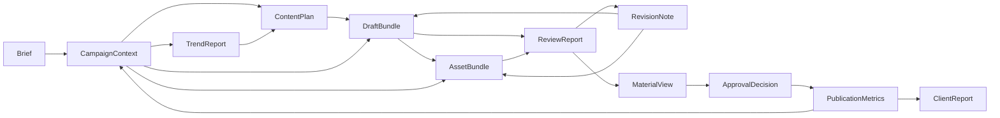

# Поток данных

Документ описывает порядок передачи данных между подсистемами комплекса на протяжении полного цикла обработки кампании.

Структуры данных определены в модулях `models.py` соответствующих подсистем. Передача выполняется API-оркестратором; подсистемы не взаимодействуют между собой напрямую.

## Сквозная цепочка передачи

## Объекты данных

| Объект | Формируется | Потребляется | Назначение |
|---|---|---|---|
| `Brief` | Рабочее место команды | Ядро персонажа | Постановка задачи на кампанию |
| `CampaignContext` | Ядро персонажа | Агент-аналитик трендов, агент-стратег, агент-креатор, агент-визуализатор, агент-хранитель бренда | Бриф, дополненный параметрами и поведенческим состоянием персонажа |
| `TrendReport` | Агент-аналитик трендов | Агент-стратег | Отобранные и отклонённые тренды с обоснованием |
| `ABRecommendation` | Система A/B-тестирования | Агент-стратег | Рекомендации по результатам предшествующих кампаний |
| `ContentPlan` | Агент-стратег | Агент-креатор | Упорядоченная очередь концептов контента |
| `DraftBundle` | Агент-креатор | Агент-визуализатор, агент-хранитель бренда | Тексты, сценарии и описания визуального ряда |
| `GenerationTask` | Агент-визуализатор | API-оркестратор | Задание на генерацию с указанием провайдеров |
| `AssetBundle` | Агент-визуализатор | Агент-хранитель бренда | Сгенерированные медиаматериалы |
| `ReviewReport` | Агент-хранитель бренда | API-оркестратор, рабочее место команды | Заключения по материалам |
| `RevisionNote` | Агент-хранитель бренда | Агент-креатор, агент-визуализатор | Замечание к доработке материала |
| `MaterialView` | Рабочее место команды | Интерфейс специалиста | Представление материала в контуре утверждения |
| `ApprovalDecision` | Рабочее место команды | API-оркестратор | Решение команды или компании об утверждении или отклонении |
| `PublicationMetrics` | Модуль публикации | Агент-аналитик метрик, рабочее место команды | Показатели эффективности публикации |
| `ClientReport` | Рабочее место команды | Компания (вне комплекса) | Периодический отчёт о ведении аккаунта |
| `CampaignRun` | API-оркестратор | Рабочее место команды | Состояние кампании и журнал выполнения этапов |

## Порядок обработки

### Постановка задачи

Сотрудник команды формирует объект `Brief` в рабочем месте команды на основании договорённостей с компанией и передаёт его API-оркестратору. Оркестратор создаёт объект `CampaignRun` в состоянии `received` и инициирует обработку.

### Обогащение контекста

Ядро персонажа принимает `Brief`, дополняет его ссылками на параметры идентичности персонажа и текущим поведенческим состоянием, возвращает объект `CampaignContext`.

Объект `CampaignContext` сохраняется на протяжении всей обработки кампании и передаётся каждой последующей подсистеме без изменений.

### Анализ трендов

Агент-аналитик трендов принимает `CampaignContext`, собирает сигналы из внешних источников, выполняет отбор и возвращает объект `TrendReport`, содержащий как принятые, так и отклонённые тренды.

### Планирование

Агент-стратег принимает `CampaignContext`, `TrendReport` и, при наличии, перечень объектов `ABRecommendation`. Возвращает объект `ContentPlan`.

При пустом перечне принятых трендов контент-план формируется на базовых сценариях персонажа, признак фиксируется в поле `fallback_used`.

### Формирование текстовых материалов

Агент-креатор принимает `CampaignContext` и `ContentPlan`, возвращает объект `DraftBundle`.

Поле `visual_description` каждой сцены передаётся агенту-визуализатору в качестве основы для формирования технических промптов.

### Генерация медиаматериалов

Агент-визуализатор принимает `CampaignContext` и `DraftBundle`, формирует перечень объектов `GenerationTask` и направляет их API-оркестратору. Оркестратор выполняет обращение к внешним генеративным сервисам и возвращает результаты.

Агент-визуализатор возвращает объект `AssetBundle`, содержащий сгенерированные материалы и перечень невыполненных заданий.

### Проверка

Агент-хранитель бренда принимает `CampaignContext`, `DraftBundle` и `AssetBundle`, возвращает объект `ReviewReport`.

### Цикл доработки

Материалы с заключением `revision_required` возвращаются подсистеме-исполнителю в составе объектов `RevisionNote`. Поле `target_agent` определяет адресата: агент-креатор при несоответствии текстовой составляющей, агент-визуализатор при несоответствии визуальной.

Доработанные материалы направляются на повторную проверку. Значение поля `revision` увеличивается при каждом цикле.

Число циклов доработки ограничено. При исчерпании лимита материал передаётся в контур Human-in-the-Loop с заключением `escalated`.

### Утверждение

Материалы с заключением `approved` преобразуются рабочим местом команды в объекты `MaterialView` и отображаются в контуре утверждения.

Решение команды фиксируется в виде объекта `ApprovalDecision`. Для материалов, по которым назначено согласование с компанией, решение компании, полученное вне комплекса, фиксируется специалистом команды отдельным объектом `ApprovalDecision` со значением `source` = `client`.

Решение передаётся API-оркестратору после получения всех требуемых согласований. Утверждение переводит кампанию в состояние `approved`, отклонение — командой или компанией — возвращает кампанию в состояние `drafting`.

### Публикация и обратная связь

Утверждённые материалы передаются в модуль публикации и размещаются специалистами команды в аккаунтах компаний. После размещения специалисты вводят показатели эффективности, формируется объект `PublicationMetrics`.

По показателям эффективности за период специалист команды формирует объект `ClientReport`, который направляется компании вне комплекса.

Агент-аналитик метрик обрабатывает показатели и передаёт результаты в ядро персонажа для обновления поведенческого состояния и в систему A/B-тестирования для формирования рекомендаций к последующим кампаниям.

## Замкнутость цикла

Результаты кампании возвращаются в ядро персонажа и систему A/B-тестирования. Обновлённое поведенческое состояние персонажа и рекомендации A/B-тестирования учитываются при обработке последующих кампаний.

## Обработка защищаемых сведений

Объекты данных не содержат параметров идентичности персонажа, системных промптов и технических промптов генеративных сервисов. Указанные сведения передаются в виде ссылок на защищённое хранилище (`identity_ref`, `voice_profile_ref`, `prompt_ref`, `system_prompt_ref`).

Выдача содержимого по ссылке выполняется отдельным сервисом доступа с проверкой прав запрашивающей подсистемы.
