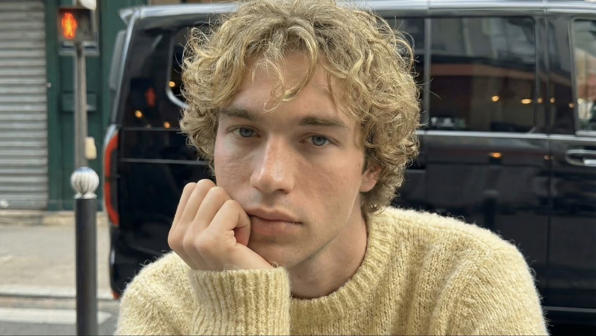
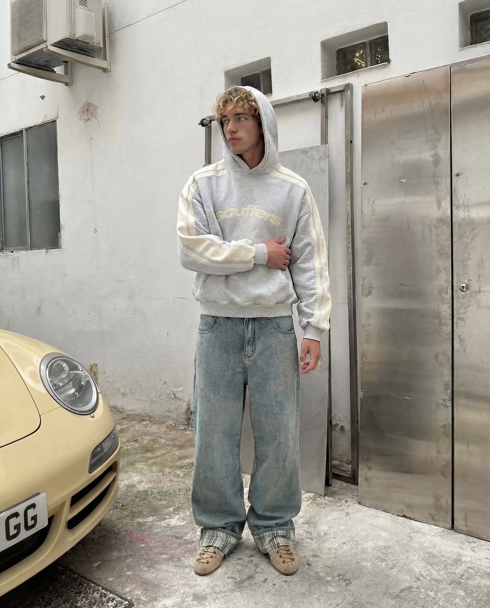
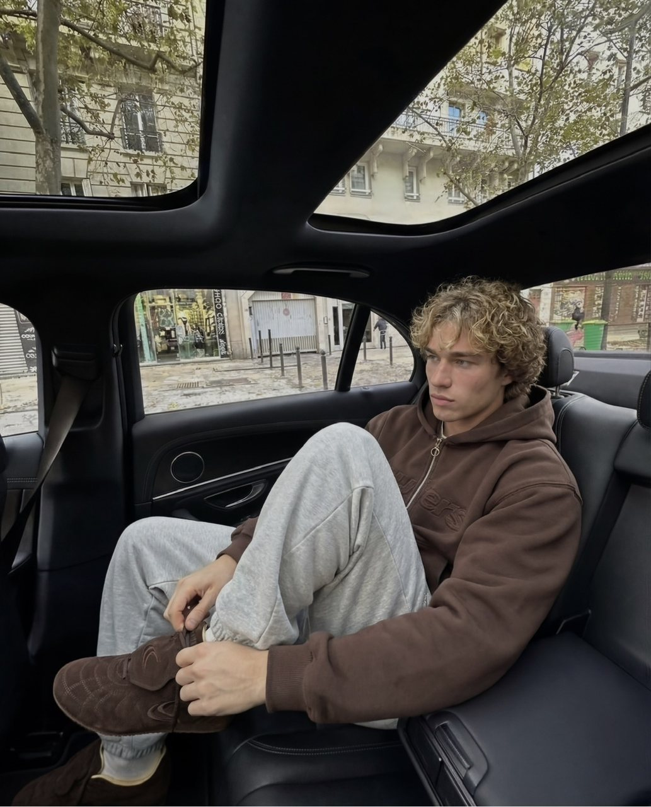
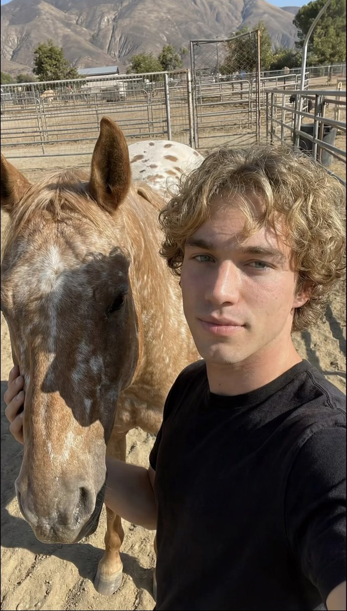
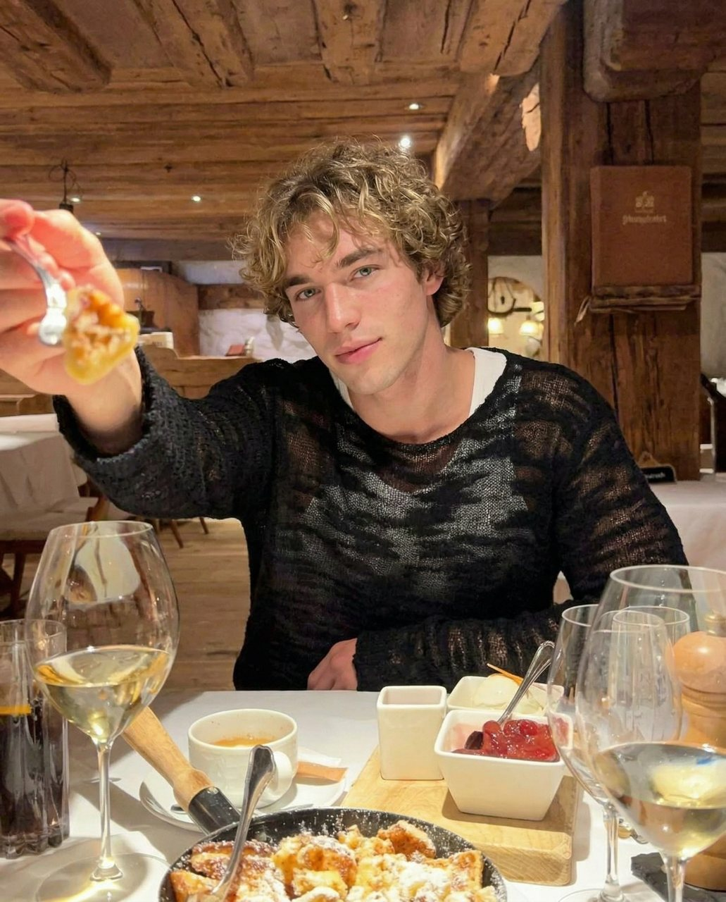
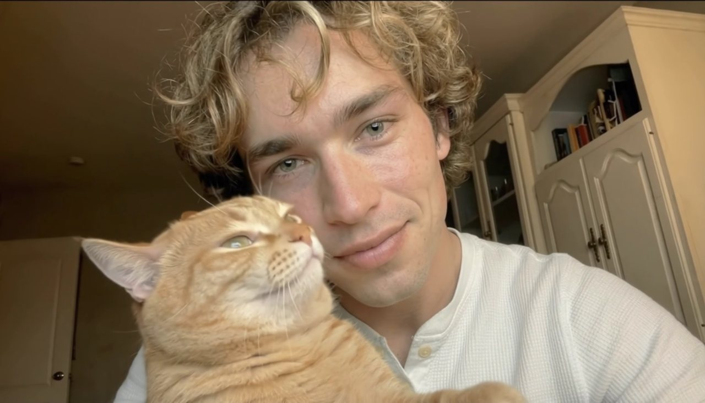
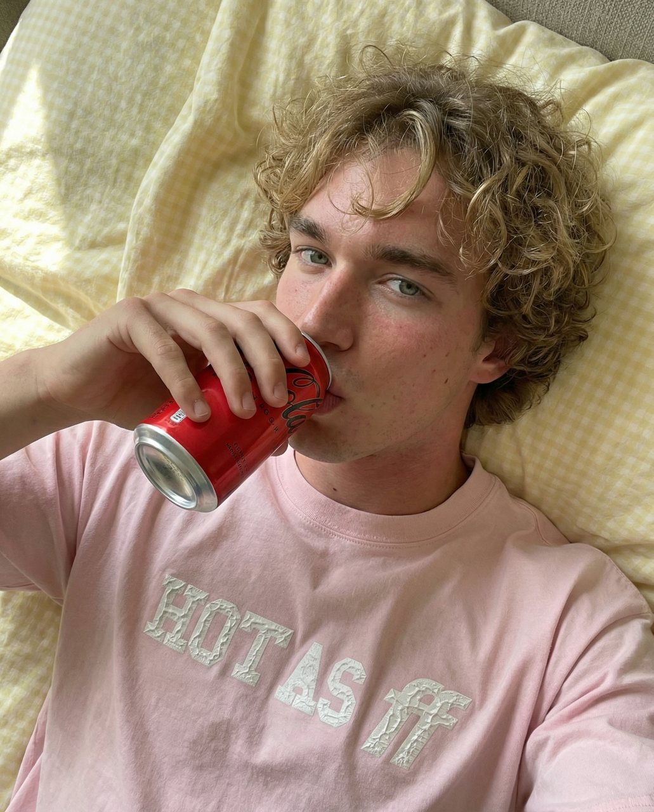
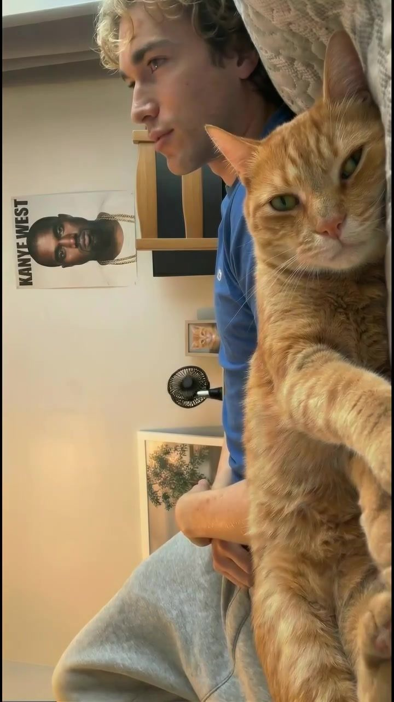

# Примеры производимого контента

Материалы виртуального персонажа Ник ([@nickitix](https://www.instagram.com/nickitix/)), произведённые в условиях коммерческой эксплуатации до начала разработки комплекса. Ник — собственный персонаж команды. Материалы приведены в качестве подтверждения применимости подхода.

## Визуальная консистентность персонажа

Устойчивое воспроизведение внешности персонажа между материалами является основным техническим требованием к подсистеме генерации. Материалы ниже подобраны так, чтобы охватить различные условия съёмки: освещение, план, ракурс, окружение.

| Материал | Условия |
|---|---|
|  | Искусственное освещение, ночь, горизонтальный кадр |
|  | Естественное освещение, крупный план, городская среда |
|  | Общий план, полный рост, рассеянное освещение |
|  | Средний план, сложная сцена с окружением |
|  | Прямой солнечный свет, контрастные тени, открытое пространство |
|  | Тёплое искусственное освещение, интерьер |

Общий план в полный рост и сцены с выраженным окружением представляют наибольшую сложность для сохранения консистентности: доля кадра, приходящаяся на лицо персонажа, минимальна, а количество элементов сцены максимально.

## Устойчивые элементы образа

Помимо внешности персонажа, консистентности требуют постоянные элементы его окружения. Для данного персонажа таким элементом является кот, присутствующий в значительной части публикуемых материалов.

## Размещение продукта в кадре

Коммерческое применение предполагает включение продукта клиента в материал без нарушения стилистики персонажа.

## Видеоматериалы

Кадры из опубликованных видеоматериалов. Полные версии доступны по ссылкам.

| Превью | Публикация |
|---|---|
|  | [Смотреть](https://www.instagram.com/reel/DUS-jrfDjOJ/) |
|  | [Смотреть](https://www.instagram.com/reel/DTu17ECDPQ3/) |
|  | [Смотреть](https://www.instagram.com/reel/DUildbAju6M/) |

## Показатели

Показатели наиболее результативного видеоматериала на момент выгрузки:

| Показатель | Значение |
|---|---|
| Просмотры | 39 598 698 |
| Отметки «Нравится» | 6 000 000 |
| Взаимодействия | 7 568 001 |
| Отправки | 695 000 |
| Репосты | 602 000 |
| Сохранения | 241 000 |
| Доля просмотров от неподписчиков | 95,1 % |

Показатели профиля: 82 публикации, 31,4 тыс. подписчиков. Три закреплённых видеоматериала: 39,5 млн, 11,7 млн и 2,8 млн просмотров.

Доля просмотров от пользователей, не подписанных на профиль, составляет 95,1 %. Показатель отражает способность материалов выходить за пределы сформированной аудитории, что является целевым свойством производимого контента.

Значения приведены по данным аналитики платформы и подлежат проверке по указанным публикациям.
