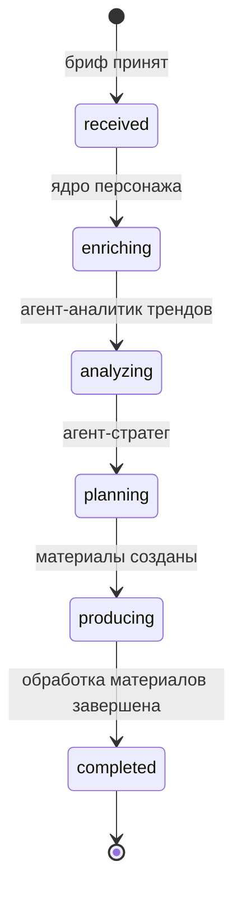
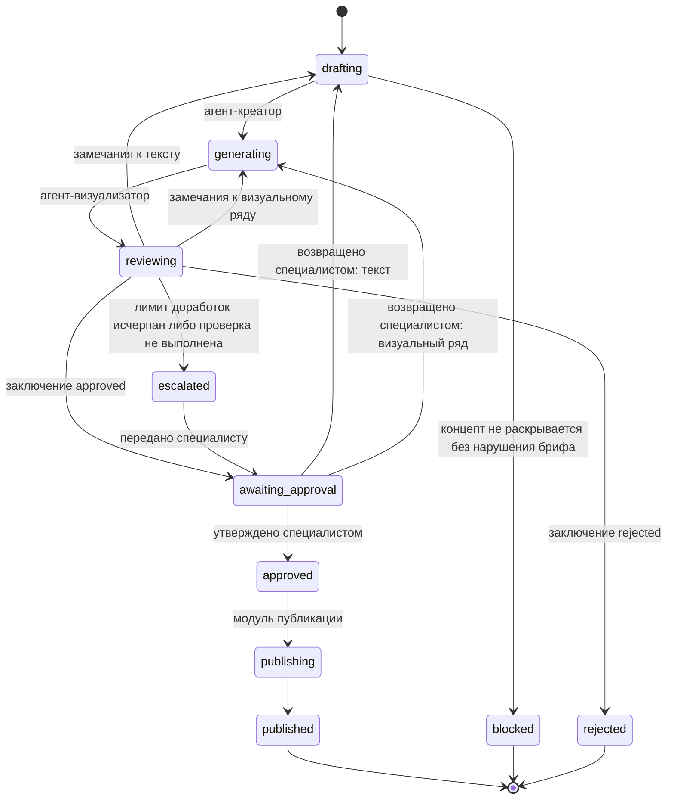

# API-оркестратор контент-пайплайна

## Роль в системе

Управляет последовательностью вызовов подсистем комплекса и внешних генеративных сервисов. Подсистемы-агенты не взаимодействуют между собой напрямую: передача данных, обработка отказов и учёт состояния кампании и материалов выполняются оркестратором.

## Зона ответственности

- Запуск подсистем в порядке, установленном схемой производственного конвейера
- Передача выходных данных одной подсистемы на вход следующей
- Направление запросов к внешним генеративным сервисам и переключение на резервных провайдеров при отказе основного
- Сборка результатов генерации в готовые медиафайлы
- Учёт состояния кампании и состояния каждого материала кампании
- Учёт числа выполненных циклов автоматической доработки каждого материала
- Возврат материалов на доработку по замечаниям агента-хранителя бренда и специалиста команды
- Передача материалов на утверждение специалисту
- Ведение журнала выполнения этапов конвейера

## Этапы кампании и этапы материала

Обработка кампании разделена на два уровня.

Этапы уровня кампании выполняются один раз для всей кампании: обогащение брифа данными персонажа, анализ трендов, формирование контент-плана. По завершении планирования для каждого концепта контент-плана создаётся материал (`MaterialRun`), и кампания переходит в состояние `producing`.

Этапы уровня материала выполняются для каждого материала отдельно: формирование текстов, генерация медиаматериалов, проверка, утверждение, публикация. Доработка, утверждение и возврат одного материала не затрагивают остальные материалы кампании.

Кампания переходит в состояние `completed`, когда обработка всех её материалов завершена.

## Схема производственного конвейера

Состояния кампании:

Состояния материала:

Из любого незавершённого состояния допускается переход в состояние `failed` при невозможности продолжить обработку; для материала в состояниях утверждения переход в `failed` не предусмотрен.

## Состояния кампании

| Код | Значение |
|---|---|
| `received` | Бриф принят, обработка не начата |
| `enriching` | Выполняется обогащение брифа данными персонажа |
| `analyzing` | Выполняется анализ трендов |
| `planning` | Выполняется формирование контент-плана |
| `producing` | Выполняется обработка материалов кампании |
| `completed` | Обработка всех материалов кампании завершена |
| `failed` | Обработка кампании прервана |

## Состояния материала

| Код | Значение |
|---|---|
| `drafting` | Выполняется формирование текстовых материалов |
| `generating` | Выполняется генерация медиаматериалов |
| `reviewing` | Выполняется проверка агентом-хранителем бренда |
| `awaiting_approval` | Материал ожидает утверждения специалистом |
| `escalated` | Материал передан человеку без автоматического заключения |
| `approved` | Материал утверждён |
| `publishing` | Материал передан в модуль публикации |
| `published` | Материал опубликован |
| `blocked` | Концепт невозможно раскрыть без нарушения ограничений брифа |
| `rejected` | Материал отклонён агентом-хранителем бренда без возможности доработки |
| `failed` | Обработка материала прервана |

## Утверждение материалов

Каждый материал перед публикацией утверждается специалистом. Переход в состояние `approved` выполняется только из состояния `awaiting_approval`, то есть только по решению человека. Переход в состояние `publishing` выполняется исключительно из состояния `approved`.

## Маршрутизация внешних сервисов

Подсистемы формируют задания на генерацию с указанием основного и резервного провайдера. Обращение к внешним сервисам выполняется оркестратором.

При отказе основного провайдера запрос направляется резервному провайдеру, указанному в задании. Логика подсистем при переключении не изменяется. Отказ провайдера фиксируется в журнале выполнения.

Отказ одного внешнего сервиса не приводит к прерыванию обработки кампании: задания, не выполненные ни основным, ни резервным провайдером, возвращаются подсистеме-инициатору в составе списка невыполненных заданий.

## Сборка готовых медиафайлов

По завершении генерации оркестратор собирает результаты генерации материала — изображения, видеофрагменты сцен, синтезированную речь — в готовый медиафайл. Ссылка на готовый медиафайл фиксируется в поле `final_media_ref` объекта `MaterialRun`. Утверждение материала специалистом выполняется по готовому медиафайлу.

## Учёт циклов доработки

Оркестратор ведёт счётчик циклов автоматической доработки для каждого материала (`revision_cycles`). Возврат материала агенту-креатору или агенту-визуализатору по замечаниям агента-хранителя бренда увеличивает значение счётчика этого материала.

Адресат доработки определяется по замечаниям: при наличии замечаний к тексту материал возвращается агенту-креатору, в остальных случаях — агенту-визуализатору. Изменение текста влечёт повторную генерацию визуального ряда.

При достижении предельного значения дальнейшие циклы автоматической доработки материала не запускаются: материал переводится в состояние `escalated` и передаётся специалисту.

Возврат материала на доработку специалистом в счётчик циклов автоматической доработки не входит.

Подсистемы-исполнители собственных счётчиков циклов доработки не ведут.

## Модель данных и схема конвейера

- [`models.py`](models.py) — структуры данных: состояние кампании, состояние материала, запись журнала выполнения
- [`pipeline.py`](pipeline.py) — этапы конвейера, таблицы допустимых переходов, правило определения состояния материала по заключению проверки

## Взаимодействие с подсистемами

1. Рабочее место команды передаёт бриф оркестратору
2. Оркестратор выполняет этапы уровня кампании и создаёт материалы по концептам контент-плана
3. Для каждого материала оркестратор выполняет этапы уровня материала; выходные данные каждой подсистемы передаются на вход следующей без преобразования
4. Задания на генерацию направляются внешним сервисам, результаты возвращаются подсистеме-инициатору
5. Материалы, прошедшие проверку, передаются на утверждение в рабочее место команды
6. Утверждённые материалы передаются в модуль публикации
7. Показатели эффективности опубликованных материалов передаются агенту-аналитику метрик

## Обработка ошибок

- При отказе основного провайдера внешнего сервиса запрос направляется резервному провайдеру; материал остаётся в текущем состоянии
- При отказе основного и резервного провайдеров невыполненные задания возвращаются подсистеме-инициатору; обработка остальных материалов продолжается
- При недоступности подсистемы выполняется повторный вызов с экспоненциальной задержкой; при исчерпании попыток кампания или материал переводится в состояние `failed` с фиксацией причины в журнале
- При исчерпании числа циклов автоматической доработки материал переводится в состояние `escalated`
- Переход, отсутствующий в таблице допустимых переходов, не выполняется

## Калибруемые параметры

Число повторных вызовов подсистемы при недоступности и параметры экспоненциальной задержки определяются по результатам эксплуатации на Этапе 2.

Предельное число циклов автоматической доработки одного материала (`max_revision_cycles`) установлено равным 3 и подлежит уточнению по фактической статистике доработок на Этапе 2.

## Статус

Схема конвейера, модель данных и правила переходов зафиксированы. Реализация маршрутизации, подключение провайдеров и ведение журнала — Этап 2.
