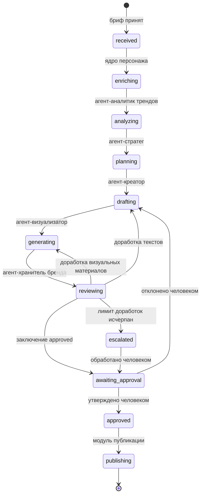

# API-оркестратор контент-пайплайна

## Роль в системе

Управляет последовательностью вызовов подсистем комплекса и внешних генеративных сервисов. Подсистемы-агенты не взаимодействуют между собой напрямую: передача данных, обработка отказов и учёт состояния кампании выполняются оркестратором.

## Зона ответственности

- Запуск подсистем в порядке, установленном схемой производственного конвейера
- Передача выходных данных одной подсистемы на вход следующей
- Направление запросов к внешним генеративным сервисам и переключение на резервных провайдеров при отказе основного
- Учёт состояния кампании и числа выполненных циклов доработки
- Возврат материалов на доработку по замечаниям агента-хранителя бренда
- Эскалация кампании контуру Human-in-the-Loop при исчерпании числа циклов доработки
- Ведение журнала выполнения этапов конвейера

## Схема производственного конвейера

## Состояния кампании

| Код | Значение |
|---|---|
| `received` | Бриф принят, обработка не начата |
| `enriching` | Выполняется обогащение брифа данными персонажа |
| `analyzing` | Выполняется анализ трендов |
| `planning` | Выполняется формирование контент-плана |
| `drafting` | Выполняется формирование текстовых материалов |
| `generating` | Выполняется генерация медиаматериалов |
| `reviewing` | Выполняется проверка агентом-хранителем бренда |
| `awaiting_approval` | Материалы переданы в контур Human-in-the-Loop |
| `escalated` | Материалы переданы человеку без автоматического заключения |
| `approved` | Материалы утверждены |
| `publishing` | Материалы переданы в модуль публикации |
| `failed` | Обработка прервана |

## Маршрутизация внешних сервисов

Подсистемы формируют задания на генерацию с указанием основного и резервного провайдера. Обращение к внешним сервисам выполняется оркестратором.

При отказе основного провайдера запрос направляется резервному провайдеру, указанному в задании. Логика подсистем при переключении не изменяется. Отказ провайдера фиксируется в журнале выполнения.

Отказ одного внешнего сервиса не приводит к прерыванию обработки кампании: задания, не выполненные ни основным, ни резервным провайдером, возвращаются подсистеме-инициатору в составе списка невыполненных заданий.

## Учёт циклов доработки

Оркестратор ведёт счётчик циклов доработки в разрезе кампании. Возврат материалов агенту-креатору или агенту-визуализатору увеличивает значение счётчика.

При достижении предельного значения, установленного в конфигурации оркестратора, дальнейшие циклы доработки не запускаются: кампания переводится в состояние `escalated` и передаётся контуру Human-in-the-Loop.

Подсистемы-исполнители собственных счётчиков циклов доработки не ведут.

## Модель данных и схема конвейера

- [`models.py`](models.py) — структуры данных: состояние кампании, запись журнала выполнения, результат этапа
- [`pipeline.py`](pipeline.py) — описание этапов конвейера и правил переходов между состояниями

## Взаимодействие с подсистемами

1. Рабочее место команды передаёт бриф оркестратору
2. Оркестратор последовательно вызывает подсистемы согласно схеме конвейера
3. Выходные данные каждой подсистемы передаются на вход следующей без преобразования
4. Задания на генерацию направляются внешним сервисам, результаты возвращаются подсистеме-инициатору
5. Материалы с заключением `approved` передаются в контур Human-in-the-Loop
6. Утверждённые материалы передаются в модуль публикации

## Обработка ошибок

- При отказе основного провайдера внешнего сервиса запрос направляется резервному провайдеру; кампания остаётся в текущем состоянии
- При отказе основного и резервного провайдеров невыполненные задания возвращаются подсистеме-инициатору; обработка остальных заданий продолжается
- При недоступности подсистемы выполняется повторный вызов с экспоненциальной задержкой; при исчерпании попыток кампания переводится в состояние `failed` с фиксацией причины в журнале
- При исчерпании числа циклов доработки кампания переводится в состояние `escalated`
- Переход в состояние `publishing` выполняется исключительно из состояния `approved`

## Калибруемые параметры

Число повторных вызовов подсистемы при недоступности и параметры экспоненциальной задержки определяются по результатам эксплуатации на Этапе 2.

Предельное число циклов доработки (`max_revision_cycles`) установлено равным 3 и подлежит уточнению по фактической статистике доработок на Этапе 2.

## Статус

Схема конвейера, модель данных и правила переходов зафиксированы. Реализация маршрутизации, подключение провайдеров и ведение журнала — Этап 2.
